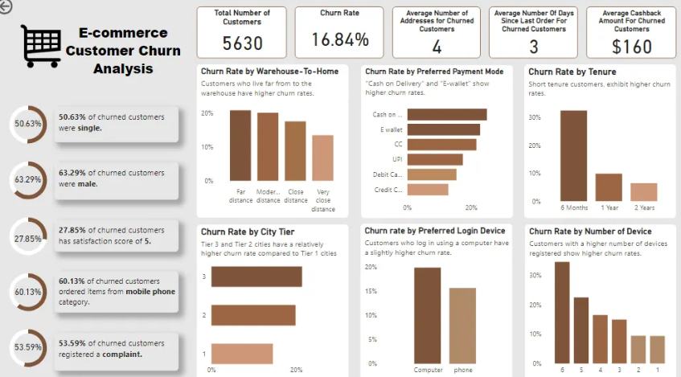
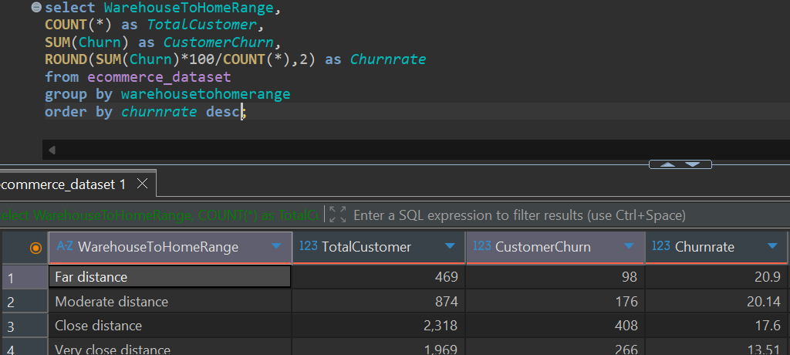

# 📊 E-Commerce Customer Churn Analysis using MySQL & Power BI

An end-to-end Data Analytics project focused on analyzing customer churn in an e-commerce business. The project covers data cleaning, feature engineering, exploratory data analysis (EDA), and interactive dashboard development using **MySQL** and **Power BI**.

---

## 📌 Project Overview

Customer churn is one of the biggest challenges faced by e-commerce businesses. Retaining existing customers is often more cost-effective than acquiring new ones.

This project analyzes customer behavior to identify the key factors influencing churn and provides business recommendations to improve customer retention.

---

## 🛠️ Tech Stack

- **MySQL** – Data Cleaning, Feature Engineering & SQL Analysis
- **Power BI** – Interactive Dashboard & Data Visualization
- **DAX** – KPI Measures and Calculated Columns
- **DBeaver** – SQL Development Environment

---

## 📂 Dataset

**Source:** Kaggle
👉 **[Click here for the Dataset](https://www.kaggle.com/datasets/ankitverma2010/ecommerce-customer-churn-analysis-and-prediction)**

Dataset contains **5,630 customer records** with demographic, transactional, and behavioral information.

---

# 📁 Project Structure

```
Ecommerce_Customer_Churn_Analysis/
│
├── Dashboard/
│   └── Ecommerce Customer Churn Analysis.pbix
│
├── Dataset/
│   └── Ecommerce Customer Churn Dataset.csv
│
├── Images/
│   ├── PowerBI_Dashboard.png
│   └── sql-eda-warehouse.png
│
├── SQL/
│   ├── 01_Data_Cleaning.sql
│   ├── 02_Feature_Engineering.sql
│   └── 03_EDA.sql
│
└── README.md
```

---

# 📊 Dashboard Preview

## Power BI Dashboard



---

## SQL Analysis Example

Warehouse Distance vs Customer Churn



---

# 🔄 Project Workflow

```
Raw Dataset
      │
      ▼
Data Cleaning (MySQL)
      │
      ▼
Feature Engineering
      │
      ▼
Exploratory Data Analysis
      │
      ▼
Power BI Dashboard
      │
      ▼
Business Insights
      │
      ▼
Recommendations
```

---

# 🧹 Data Cleaning

The dataset was cleaned and standardized using MySQL.

### ✔ Data Cleaning Tasks

- Calculated total number of customers
- Checked duplicate records
- Identified missing values
- Replaced blank values with NULL
- Imputed missing numerical values using column averages
- Created **CustomerStatus** column from **Churn**
- Created **ComplainReceived** column from **Complain**
- Standardized categorical values
- Corrected inconsistent entries
- Corrected invalid Warehouse-to-Home values
- Converted appropriate columns into integer data types

### ✔ Standardization Performed

**Preferred Login Device**

- Phone → Mobile Phone

**Preferred Payment Mode**

- CC → Credit Card
- COD → Cash on Delivery

**Preferred Order Category**

- Mobile → Mobile Phone

**Warehouse Distance**

- 127 → 27
- 126 → 26

---

# ⚙ Feature Engineering

Created additional columns to improve analysis.

- CustomerStatus
- ComplainReceived
- WarehouseToHomeRange
- TenureRange
- CashbackAmountRange

---

# 📈 Exploratory Data Analysis

The following business questions were answered using SQL.

1. Overall customer churn rate
2. Churn rate by preferred login device
3. Customer distribution across city tiers
4. Warehouse distance vs churn
5. Preferred payment mode among churned customers
6. Typical tenure of churned customers
7. Gender-wise churn comparison
8. Average app usage by churn status
9. Registered devices vs churn
10. Preferred order category among churned customers
11. Satisfaction score vs churn
12. Marital status influence on churn
13. Average number of addresses for churned customers
14. Customer complaints vs churn
15. Coupon usage comparison
16. Average days since last order
17. Cashback amount vs churn rate

---

# 📌 Key Insights

- Dataset contains **5,630 customers**.
- Overall churn rate is **16.84%**.
- Computer users churn slightly more than mobile users.
- Tier 2 and Tier 3 cities experience higher churn.
- Customers living farther from warehouses churn more frequently.
- Cash on Delivery and E-wallet users have higher churn rates.
- Longer customer tenure reduces churn.
- Male customers churn slightly more than female customers.
- App usage time has minimal impact on churn.
- Customers using multiple devices are more likely to churn.
- Mobile Phone category records the highest churn.
- Customer complaints strongly correlate with churn.
- Married customers churn less than single customers.
- Higher coupon usage improves retention.
- Higher cashback amounts generally reduce churn.

---

# 📉 Power BI Dashboard

The dashboard includes:

### KPI Cards

- Total Customers
- Churned Customers
- Churn Rate
- Average Cashback
- Average Number of Addresses
- Average Days Since Last Order

### Interactive Visualizations

- Churn by City Tier
- Warehouse Distance
- Payment Mode
- Login Device
- Order Category
- Customer Satisfaction
- Registered Devices
- Gender
- Marital Status
- Cashback Analysis
- Customer Complaints

---

# 💡 Business Recommendations

- Improve desktop user experience.
- Optimize delivery logistics for distant customers.
- Encourage secure digital payment methods.
- Strengthen complaint resolution processes.
- Develop loyalty programs for new customers.
- Increase customer engagement for Mobile Phone buyers.
- Deliver a consistent cross-device experience.
- Reward satisfied customers through personalized offers.
- Optimize cashback incentives to improve retention.

---

# 🎯 Skills Demonstrated

- SQL Data Cleaning
- Data Validation
- Feature Engineering
- Exploratory Data Analysis (EDA)
- Business Intelligence
- DAX Measures
- Dashboard Design
- Data Visualization
- Business Insight Generation

---

# 👩‍💻 Connect with me

**Sumayya Tabasum**

- GitHub: https://github.com/sumayyatabasum
- LinkedIn: https://www.linkedin.com/in/sumayya-tabasum-shaik-68a9582a4

---
